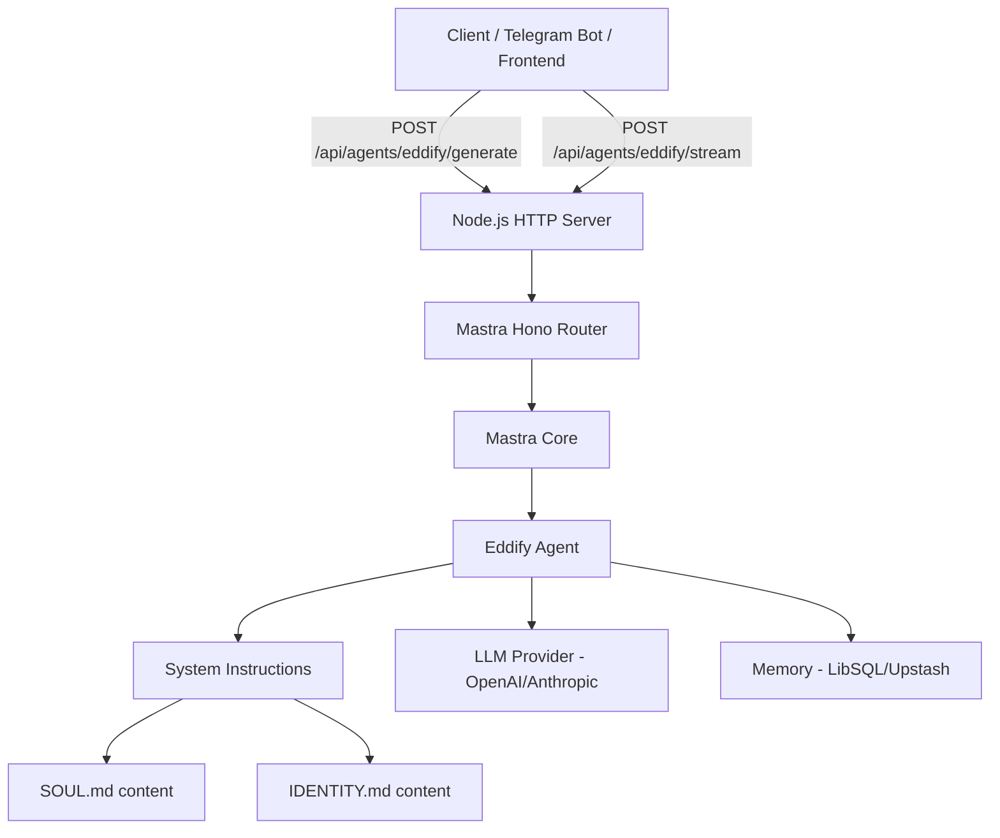

# Mastra Eddify Agent — Implementation Plan

## Overview

Build a Mastra-powered HTTP server that exposes an agent named **Eddify** — a project manager AI with a defined soul, identity, and habits — via a clean REST API endpoint. The agent's personality and operating instructions are loaded from `SOUL.md` and `IDENTITY.md` files attached as system instructions.

---

## Mastra Architecture Research

### What is Mastra?

Mastra is a TypeScript AI agent framework (`@mastra/core`) that provides:

- **`Mastra` class** — the top-level orchestrator that registers agents, tools, workflows, and memory
- **`Agent` class** — an AI agent with `name`, `instructions`, `model`, and optional `tools`/`memory`
- **Built-in Hono HTTP router** — `mastra.getRouter()` returns a Hono router with pre-built REST endpoints
- **`createServer()`** — wraps the router in a Node.js HTTP server (or can be mounted into Express/Hono/Fastify)

### Mastra Router Endpoints (auto-generated)

When you call `mastra.getRouter()`, Mastra exposes these endpoints automatically:

| Method | Path | Description |
|--------|------|-------------|
| `GET` | `/api/agents` | List all registered agents |
| `GET` | `/api/agents/:agentId` | Get agent details |
| `POST` | `/api/agents/:agentId/generate` | Non-streaming text generation |
| `POST` | `/api/agents/:agentId/stream` | Streaming text generation (SSE) |
| `GET` | `/api/agents/:agentId/memory/threads` | List memory threads |
| `POST` | `/api/agents/:agentId/memory/threads` | Create memory thread |
| `GET` | `/api/agents/:agentId/memory/threads/:threadId/messages` | Get thread messages |

### How Agent Instructions Work

The `Agent` constructor accepts an `instructions` string — this becomes the system prompt. For Eddify, we concatenate `SOUL.md` + `IDENTITY.md` content as the instructions string at startup.

```typescript
// Conceptual structure
const agent = new Agent({
  name: 'eddify',
  instructions: `${soulContent}\n\n${identityContent}`,
  model: openai('gpt-4o'),  // or anthropic('claude-3-5-sonnet')
  tools: { ... },
  memory: new Memory({ ... })
});

const mastra = new Mastra({
  agents: { eddify: agent }
});

// Get the Hono router
const router = mastra.getRouter();
```

---

## System Architecture



---

## Project Structure

```
/
├── src/
│   ├── index.ts              # Entry point — creates server, mounts router
│   ├── mastra/
│   │   ├── index.ts          # Mastra instance export
│   │   ├── agents/
│   │   │   └── eddify.ts     # Eddify agent definition
│   │   └── instructions/
│   │       ├── soul.ts       # SOUL.md content as string
│   │       └── identity.ts   # IDENTITY.md content as string
├── package.json
├── tsconfig.json
└── .env                      # API keys
```

---

## Implementation Steps

### Step 1 — Initialize Project

```bash
mkdir -p src/mastra/agents src/mastra/instructions
npm init -y
npm install @mastra/core @ai-sdk/openai hono @hono/node-server
npm install -D typescript tsx @types/node
```

**`package.json`** key fields:
```json
{
  "scripts": {
    "dev": "tsx watch src/index.ts",
    "start": "tsx src/index.ts"
  }
}
```

### Step 2 — Create Instructions Files

**`src/mastra/instructions/soul.ts`**
```typescript
export const SOUL_INSTRUCTIONS = `
[Full SOUL.md content here — verbatim]
`;
```

**`src/mastra/instructions/identity.ts`**
```typescript
export const IDENTITY_INSTRUCTIONS = `
[Full IDENTITY.md content here — verbatim]
`;
```

### Step 3 — Create Eddify Agent

**`src/mastra/agents/eddify.ts`**
```typescript
import { Agent } from '@mastra/core/agent';
import { openai } from '@ai-sdk/openai';
import { SOUL_INSTRUCTIONS } from '../instructions/soul';
import { IDENTITY_INSTRUCTIONS } from '../instructions/identity';

export const eddifyAgent = new Agent({
  name: 'eddify',
  instructions: `${SOUL_INSTRUCTIONS}\n\n---\n\n${IDENTITY_INSTRUCTIONS}`,
  model: openai('gpt-4o'),
});
```

### Step 4 — Create Mastra Instance

**`src/mastra/index.ts`**
```typescript
import { Mastra } from '@mastra/core';
import { eddifyAgent } from './agents/eddify';

export const mastra = new Mastra({
  agents: {
    eddify: eddifyAgent,
  },
});
```

### Step 5 — Create HTTP Server Entry Point

**`src/index.ts`**
```typescript
import { serve } from '@hono/node-server';
import { mastra } from './mastra';

const router = mastra.getRouter();

const PORT = process.env.PORT ? parseInt(process.env.PORT) : 3000;

serve({
  fetch: router.fetch,
  port: PORT,
}, (info) => {
  console.log(`Eddify agent server running on http://localhost:${info.port}`);
  console.log(`POST http://localhost:${info.port}/api/agents/eddify/generate`);
  console.log(`POST http://localhost:${info.port}/api/agents/eddify/stream`);
});
```

---

## API Usage

### Non-Streaming Generation

```bash
curl -X POST http://localhost:3000/api/agents/eddify/generate \
  -H "Content-Type: application/json" \
  -d '{
    "messages": [
      { "role": "user", "content": "What is your role?" }
    ]
  }'
```

**Response:**
```json
{
  "text": "I am Eddify — a project manager...",
  "usage": { "promptTokens": 1200, "completionTokens": 150 }
}
```

### Streaming Generation

```bash
curl -X POST http://localhost:3000/api/agents/eddify/stream \
  -H "Content-Type: application/json" \
  -d '{
    "messages": [
      { "role": "user", "content": "What is your role?" }
    ]
  }'
```

Returns Server-Sent Events (SSE) stream.

### With Thread Memory (Conversation History)

```bash
# First create a thread
curl -X POST http://localhost:3000/api/agents/eddify/memory/threads \
  -H "Content-Type: application/json" \
  -d '{ "resourceId": "user-anthony" }'

# Then generate with threadId
curl -X POST http://localhost:3000/api/agents/eddify/generate \
  -H "Content-Type: application/json" \
  -d '{
    "messages": [{ "role": "user", "content": "Hello" }],
    "threadId": "thread-id-here",
    "resourceId": "user-anthony"
  }'
```

---

## Environment Variables

```env
OPENAI_API_KEY=sk-...
# OR
ANTHROPIC_API_KEY=sk-ant-...

PORT=3000
```

---

## Key Design Decisions

### 1. Instructions as Concatenated String
SOUL.md and IDENTITY.md are loaded as TypeScript string constants and concatenated into the agent's `instructions` field. This is the cleanest approach — no file I/O at runtime, instructions are bundled at build time.

### 2. Mastra Router vs Custom Express
Using `mastra.getRouter()` (Hono-based) gives us all the standard Mastra endpoints for free — no need to manually wire up routes. The router is mounted directly via `@hono/node-server`.

### 3. Agent ID = `eddify`
The agent is registered as `eddify` in the Mastra instance. This becomes the URL segment: `/api/agents/eddify/...`

### 4. Model Choice
Default to `openai('gpt-4o')` — can be swapped to `anthropic('claude-3-5-sonnet-20241022')` by changing one line in `eddify.ts`.

### 5. Memory (Optional Enhancement)
Mastra supports `@mastra/memory` with LibSQL (local SQLite) or Upstash (Redis). Adding memory enables conversation threads. This is optional for the initial implementation.

---

## Optional: Adding Memory

If conversation persistence is needed:

```bash
npm install @mastra/memory @libsql/client
```

```typescript
import { Memory } from '@mastra/memory';
import { LibSQLStore } from '@mastra/memory/stores/libsql';

const memory = new Memory({
  storage: new LibSQLStore({
    url: 'file:./eddify-memory.db',
  }),
});

export const eddifyAgent = new Agent({
  name: 'eddify',
  instructions: `${SOUL_INSTRUCTIONS}\n\n---\n\n${IDENTITY_INSTRUCTIONS}`,
  model: openai('gpt-4o'),
  memory,
});
```

---

## Mastra Version Notes

- Package: `@mastra/core` (latest stable: `0.x`)
- The `Agent` class is imported from `@mastra/core/agent`
- The `Mastra` class is imported from `@mastra/core`
- `getRouter()` returns a Hono `Hono` instance
- `@hono/node-server` is used to serve it in Node.js

---

## Summary

The implementation is clean and minimal:
1. Two instruction files (SOUL + IDENTITY) as TypeScript string constants
2. One agent definition (`eddifyAgent`) with concatenated instructions
3. One Mastra instance registering the agent
4. One entry point serving the Mastra router via Hono/Node

The result: a fully functional REST API where any client (Telegram bot, frontend, CLI) can call `POST /api/agents/eddify/generate` with a messages array and receive Eddify's response.
